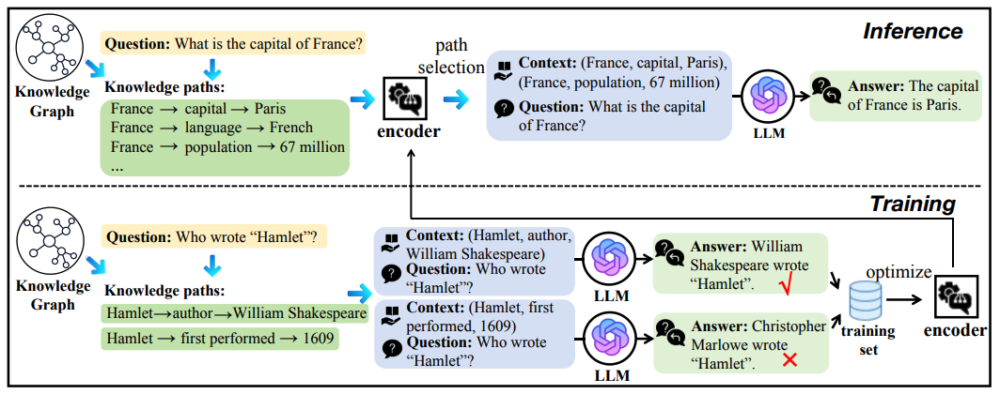

# Knowledge Graph-Enhanced Large Language Models via Path Selection

The codes are associated with the following paper:

>**Knowledge Graph-Enhanced Large Language Models via Path Selection,**  [PDF](https://arxiv.org/pdf/2406.13862) 
>Haochen Liu, Song Wang, Yaochen Zhu, Yushun Dong, Jundong Li,     
>Annual Meeting of the Association for Computational Linguistics (ACL), 2024.

<p align="center">

</p>

## 1. Datasets

The dataset, requirements, and data preparation follow the setting of [KG-GPT](https://github.com/jiho283/KG-GPT/). 

Download [FactKG](https://github.com/jiho283/FactKG) and [MetaQA](https://github.com/yuyuz/MetaQA) here.

## 2. Openai Key

Write your own OpenAI API key in factkg/openai_api_key.txt and metaqa/openai_api_key.txt and save them.

## 3. Building of the Training Data

To build the specific training data from the original datasets:

Run

    cd factkg
    python make_training_set.py


## 4. Training

To train our model on dataset:

Run

    python pretrain_LM_encoder.py

## 4. Evaluation

To test the trained model:

Run

    python test.py

## 5. Acknowledgment

The dataset, requirements, and data preparation follow the setting of [KG-GPT](https://github.com/jiho283/KG-GPT/). 

Thanks to the authors and developers!

## 6. Citation
If you find this work is helpful to your research, please consider citing our paper:
```
@inproceedings{liu-etal-2024-knowledge-graph,
    title = "Knowledge Graph-Enhanced Large Language Models via Path Selection",
    author = "Liu, Haochen and Wang, Song and Zhu, Yaochen and Dong, Yushun and Li, Jundong",
    editor = "Ku, Lun-Wei  and Martins, Andre and Srikumar, Vivek",
    booktitle = "Findings of the Association for Computational Linguistics: ACL 2024",
    month = aug,
    year = "2024",
    address = "Bangkok, Thailand",
    publisher = "Association for Computational Linguistics",
    pages = "6311--6321",
}
```
**Thanks for your interest in our work!**